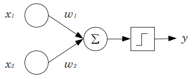
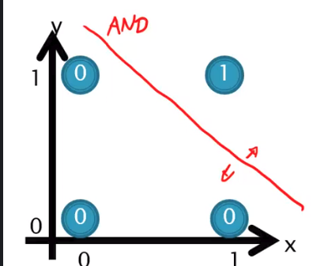
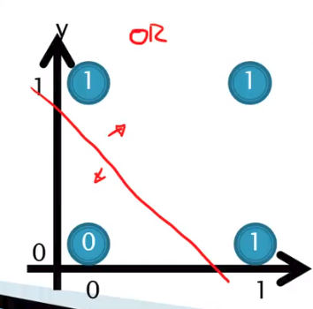
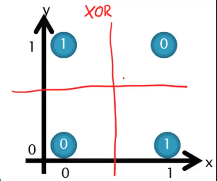
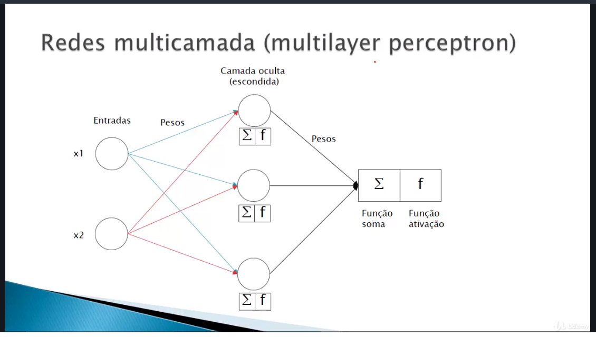

# Redes Neurais Artificiais em Python

A teoria e a prática para os fundamentos das redes neurais em Python e Deep Learning!

_** este repositório foi feito para armazenzar e comporovar as praticas adquiridas no curso [Redes Neurais Artificiais em Python](https://www.udemy.com/course/redes-neurais-artificiais-em-python/)_ do Instrutor [Jones Granatyr](https://www.udemy.com/user/jones-granatyr/);

Os conteúdos nele mantidos são:

- [Rede Neural Perceptron simples](https://github.com/thinkerston/Redes-Neurais-Artificiais-Fudamentos/blob/master/01-Perceptron.py)
    
    Neste codigo fizemos a implementação de uma rede Perceptron, com a função soma e função de ativação StepFunction;

    

- [Rede Neural Perceptron simples com implemetação da biblioteca Numpy](https://github.com/thinkerston/Redes-Neurais-Artificiais-Fudamentos/blob/master/02-Perceptron.py)
  
    Aqui atualizamos alguns procedimentos (entrada, pesos e função soma) com a biblioteca Numpy para obter maior eficiência e e praticidade no codigo

- [Rede Neural Perceptron com Ajuste de Pesos para resolver o operador logico "AND"](https://github.com/thinkerston/Redes-Neurais-Artificiais-Fudamentos/blob/master/03-Perceptron-ajuste-pesos.py)

    Neste codigo resolvemos o problema do operador logico "AND" que é um problema linearmente separável,  para isso fizemos a implementação da função treinar onde é calculado o ajuste de pesos da rede neural. O ajuste de pesos é uma caracteristica da rede neural que visa obter o melhor conjuto de pesos para obter menor erro na solução de um problema;

    

- [Rede Neural Perceptron para resolver o operador logico "OR"](https://github.com/thinkerston/Redes-Neurais-Artificiais-Fudamentos/blob/master/03-Perceptron-ajuste-pesos.py)

    Neste codigo resolvemos o problema do operador logico "OR", que por sua vez é linearmente separável,e muito semelhante ao operador logico "AND";

    

- [Rede Neural Multilayer Perceptron para resolver o operador logico "XOR"](https://github.com/thinkerston/Redes-Neurais-Artificiais-Fudamentos/blob/master/03-Perceptron-ajuste-pesos.py)

    Neste codigo resolvemos iremos implementar uma nova forma de Rede Neural, a [Multilayer Perceptron](https://en.wikipedia.org/wiki/Multilayer_perceptron), que é bem semelhante a Perceptron simples, porém como o próprio nome diz, ela apresenta diversas camadas, seus modelo de arquitetura de rede pode variar das mais diversas formas. Neste codigo iremos resolver o problema do operador lógico "XOR" que diferentemente dos anteriores não é um problema linearmente separável.

    

    Para isso a Sua arquitetura será de 2 Entradas 3 Camadas Ocultas e 1 saída
    